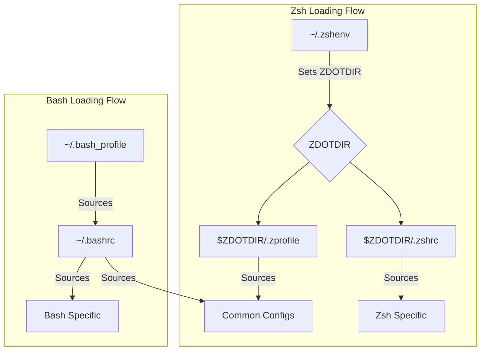

# Dotfiles

A collection of configuration files for various tools and shells.

## Prerequisites

Before installing, ensure you have the following installed:

- **Zsh**: Most modern systems have this by default.
- **Oh My Zsh**: Required for the Zsh configuration. Install it via:
  ```bash
  sh -c "$(curl -fsSL https://raw.githubusercontent.com/ohmyzsh/ohmyzsh/master/tools/install.sh)"
  ```
- **Git**: Required for cloning the repository and many aliases.

### Optional Plugins (Recommended)

To get the most out of the Zsh configuration, install these plugins via Homebrew:

```bash
brew install zsh-autosuggestions zsh-syntax-highlighting
```

## Features

- **Shell Configurations**: ZSH and Bash configurations with useful aliases and functions
- **Git Configuration**: Aliases, colors, and useful defaults
- **Tmux Configuration**: Custom keybindings and status bar
- **Ruby Configuration**: Gem settings
- **Cross-platform Support**: Works on macOS and Linux
- **DRY Configuration**: Shared configuration between Bash and Zsh

## Key Features & Usage

### Shell Aliases & Functions

The following core tools are available in both Zsh and Bash:

- **`sysinfo`**: Display a colorful summary of system hardware, OS, and network info.
- **`mkcd [dir]`**: Create a new directory and immediately change into it.
- **`extract [file]`**: Smart extraction for almost any compressed file format (zip, tar.gz, rar, 7z, etc.).
- **`server [port]`**: Start a quick HTTP server in the current directory (defaults to port 8000).
- **`ll` / `la`**: Improved directory listings with color and detail.
- **Git Shortcuts**: `gs` (status), `gc` (commit), `gp` (push), `gl` (pull), `gd` (diff).

### Tmux Configuration

Custom bindings for a more efficient workflow:

- **`Ctrl-b + r`**: Reload the tmux configuration.
- **`Ctrl-b + h/j/k/l`**: Move between panes using Vim-style keys (Left, Down, Up, Right).

## Directory Structure

```
.dotfiles/
├── bash/           # Bash-specific configuration files
├── bin/            # Executable scripts
├── git/            # Git configuration files
├── ruby/           # Ruby configuration files
├── shell/          # Shared shell configurations
│   ├── common/     # Common configuration files for all shells
│   │   ├── aliases.sh    # Common aliases
│   │   ├── exports.sh    # Common environment variables
│   │   ├── functions.sh  # Common shell functions
│   │   └── path.sh       # Common PATH setup
│   ├── bash_specific.sh  # Bash-specific settings
│   └── zsh_specific.sh   # Zsh-specific settings
├── tmux/           # Tmux configuration files
├── zsh/            # ZSH-specific configuration files (with leading dots)
├── install.sh      # Installation script
└── README.md       # This file
```

## Installation

### 1. Clone the repository

```bash
git clone https://github.com/beol/dotfiles.git ~/.dotfiles
cd ~/.dotfiles
```

### 2. Run the installation script

```bash
./install.sh
```

This will:

- Create symbolic links for all configuration files
- Backup any existing configuration files
- Detect your OS and create the appropriate links

## Manual Installation

If you prefer to create the symlinks manually, you can do so with the following commands:

```bash
# ZSH - only need to symlink .zshenv since it sets ZDOTDIR
ln -s ~/.dotfiles/zsh/.zshenv ~/.zshenv
# No need for these symlinks as zsh will find them in $ZDOTDIR:
# ln -s ~/.dotfiles/zsh/.zshrc ~/.zshrc
# ln -s ~/.dotfiles/zsh/.zprofile ~/.zprofile

# Git
ln -s ~/.dotfiles/git/gitconfig ~/.gitconfig
ln -s ~/.dotfiles/git/gitignore ~/.gitignore

# Ruby
ln -s ~/.dotfiles/ruby/gemrc ~/.gemrc

# Tmux
ln -s ~/.dotfiles/tmux/tmux.conf ~/.tmux.conf

# Bash (macOS)
ln -s ~/.dotfiles/bash/bash_profile ~/.bash_profile
ln -s ~/.dotfiles/bash/bashrc ~/.bashrc
ln -s ~/.dotfiles/bash/inputrc ~/.inputrc

# Bash (Linux)
ln -s ~/.dotfiles/bash/bashrc ~/.bashrc
ln -s ~/.dotfiles/bash/inputrc ~/.inputrc
```

## Configuration Structure

### Shared Configuration

The repository uses a DRY (Don't Repeat Yourself) approach to shell configuration:

1. **Common Files**: Located in `shell/common/` directory, these files are sourced by both Bash and Zsh:

   - `path.sh`: PATH setup, including Homebrew paths with architecture detection
   - `exports.sh`: Common environment variables
   - `aliases.sh`: Common command aliases
   - `functions.sh`: Useful shell functions

2. **Shell-Specific Files**: Located in the `shell/` directory:

   - `bash_specific.sh`: Bash-specific settings (prompt, completion, etc.)
   - `zsh_specific.sh`: Zsh-specific settings (Oh My Zsh, plugins, etc.)

3. **Loading Order**:



## Customization

- **Machine-specific Git**: Create a `~/.gitconfig.local` file, which will be included automatically
- **Shell Functions**: Add your own functions to the common functions file
- **Aliases**: Add your own aliases to the common aliases file

## Troubleshooting & Maintenance

### Reloading Configuration

After making changes to your dotfiles, you can reload your shell environment:

- **Zsh**: `source ~/.zshrc`
- **Bash**: `source ~/.bashrc`

### Restoring Backups

The installation script creates a timestamped backup of your original configuration files in:

`~/.dotfiles_backup/YYYYMMDD_HHMMSS/`

To revert a change, simply copy the desired file back to your home directory.

### Zsh Completion Issues

If you encounter issues with Zsh completions, try clearing the completion cache:

```bash
rm -f ~/.zcompdump*
exec zsh
```
